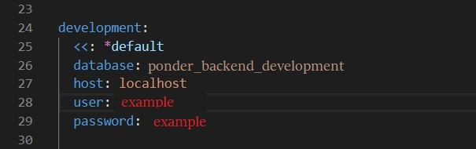

# ponder_frontend

Park app. Browse USA parks, add likes, leave comments.


<h1 align="center">PONDER</h1>
<h3 align="center">Collaboration with Taevon Jordan.</h3>
<div align="center">
</img>
<p><i>In purpose of demo backend of the project seeded for California and Florida states only.</i> </p>
</div>
<h2>About The Project</h2>
<p> Parks app. Browse parks by choosing a state, add likes, leave comments.</p> 
<p><b>Backend repo:</b> https://github.com/yulia-2008/ponder_backend</p> 

<h2>Features</h2>
<p>- Searching through US National Parks.</p>
<p>- Adding comments, likes.</p>
<p>- Deleting comments.</p>

<h2>Built With:</h2>
  <b>Vanila JavaScript</b>. 

<h2>Getting Started</h2>
<p><b>Instructions on setting up the project locally.</b> </p>
<p> 1. Make sure you have following tools installed on the system.</p>
<p>- Ruby 2.6.1 </p>
<p>- Rails 6.0.3.3 </p>
<p>- Postgresql </p>
<p> 2. In your terminal go to the directory where you want to clone this project.</p>

```sh
cd <FOLDER_NAME>
```

<p> 3.  Clone frontend and backend repos to the same folder.</p>

```sh
git clone  https://github.com/yulia-2008/ponder_frontend
```

```sh
git clone  https://github.com/yulia-2008/ponder_backend
```
<p> <b>Backend installation: </b> </p>

<p> 1. In <b>config/database.yml</b> file enter your postgres user for the project and password as shown below:</p>
 <div align="center">
 </img>
 </div>
 
 <p> 2. Make sure you are in the project backend directory. </p>
      
```sh
cd ponder_backend
```
 
 <p> 3. Run the following commands to create and setup the database. </p>
     
```sh
rails db:create
```
     
```sh
rails db:migrate
``` 
 <p> 4. Start rails server.</p>

```sh
rails s
```
<p> <b>Frontend installation: </b></p>
 <p> 1. In your terminal go to frontend directory.</p>
 
```sh
cd ponder_frontend
```

 <p> 2. Install NPM packages:</p>
 
```sh
npm install
```

 <p> 3. Run the app: open index.html file</p>

<p> 4. Now you can visit the app on the URL http://localhost:3000 </p>


